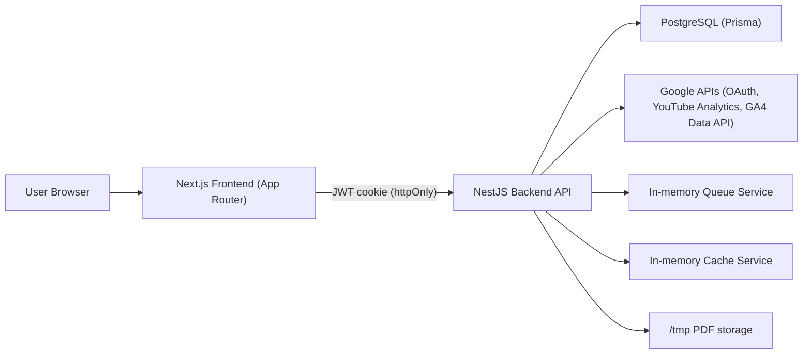

# Pulse SaaS - Project Overview (V1)

## 1) Stack technique

### Frontend
- Next.js 14 (App Router)
- React 18
- TypeScript
- Tailwind CSS
- Framer Motion
- Recharts
- Zustand
- TanStack React Query
- tRPC client

### Backend
- NestJS 10
- TypeScript
- Prisma ORM
- PostgreSQL
- Passport Google OAuth2
- JWT
- class-validator / class-transformer
- helmet
- cookie-parser

### Monorepo / Tooling
- pnpm workspaces
- Turborepo
- package shared `@pulse/shared` pour les types et le contrat tRPC

### Infra locale
- Docker Compose (Postgres + Redis)

---

## 2) Architecture du monorepo

- `apps/frontend`: landing page marketing + dashboard SaaS
- `apps/backend`: API NestJS modulaire
- `packages/shared`: types metier (YouTube/GA4) + routeur tRPC de base

---

## 3) Architecture applicative (runtime)

---

## 4) Schema de donnees (Prisma)

### Multi-tenant et RBAC
- `Workspace`
- `WorkspaceMember`
- `WorkspaceInvitation`
- Roles: `OWNER`, `EDITOR`, `VIEWER`

### Utilisateur / Auth
- `User`
- `activeWorkspaceId`
- `googleTokens` chiffres

### Analytics / IA / Reporting
- `AnalyticsSnapshot`
- `AiDigest`
- `Report`
- `ReportSchedule`
- `ReportDelivery`

### Securite / Gouvernance
- `SecretVersion` (rotation secrets)
- `AuditLog` (audit trail)

---

## 5) Features V1 developpees

### Authentification
- Login Google OAuth2
- Callback OAuth + cookie `pulse_access_token`
- Option `rememberMe`
- Logout backend + redirection frontend

### Workspace + RBAC
- Workspace par defaut auto-cree au premier login
- Switch workspace actif
- Renommage workspace (OWNER)
- Invitations membres (OWNER/EDITOR)
- Revocation invitation (OWNER/EDITOR)
- Changement role membre (OWNER)
- Suppression membre (OWNER/EDITOR selon regles)

### Analytics (donnees reelles Google)
- `/analytics/overview`
- `/analytics/youtube`
- `/analytics/ga4`
- `/analytics/correlations`
- Gestion du cas GA4 non configuree avec message et CTA

### Correlations
- Correlation Pearson YouTube <-> web
- Detection du meilleur lag (decalage en jours)
- Insight textuel automatique

### Rapports V2
- Creation rapport hebdo/mensuel
- File de traitement asynchrone
- Schedules config (hebdo + mensuel)
- Retry rapport
- Retry d'un delivery
- Download PDF
- Historique des envois

### PDF
- Generation via Puppeteer si disponible
- Fallback PDF local si Puppeteer indisponible

### Ops / Observabilite
- Panel ops cache: `/internal/ops`
- Endpoints:
  - `/ops/health`
  - `/ops/metrics`
  - `/ops/logs`
  - `/ops/audit`
- Protection optionnelle via `OPS_PANEL_KEY`

### Frontend / UX
- Landing page conversion oriented (dark/light)
- Hero interactif avec animation canvas (signal mesh)
- Menu hamburger mobile sur LP
- Dashboard complet:
  - `/overview`
  - `/youtube`
  - `/analytics`
  - `/correlations`
  - `/reports`
  - `/workspace`
  - `/internal/ops`
- Sidebar + Header:
  - etat actif
  - theme toggle
  - badge workspace/role
  - bouton deconnexion
- Skeleton loaders

---

## 6) Methodologie appliquee

- Architecture modulaire par domaine (NestJS)
- Contrat API coherent:
  - Success envelope: `success/data/meta`
  - Error envelope standardise via global exception filter
- DTO + validation centralisee
- Guards globaux:
  - JWT guard
  - Roles guard
  - Route rate limit guard
- Typescript strict (socle)
- Design system par tokens CSS (dark/light)
- Iterations UX basees sur feedback reel

---

## 7) Securite

- Helmet + CSP
- Cookies httpOnly
- `secure` active en production
- `sameSite=lax`
- Chiffrement tokens Google en AES-256-GCM
- Rotation de secrets supportee (keyring)
- RBAC par workspace
- Rate limiting par route sensible
- Audit trail persistant

---

## 8) Tests et qualite

### Backend tests unitaires
- AuthService
- CorrelationService
- TokenCryptoService (rotation incluse)
- RouteRateLimitGuard

### Couverture (Jest)
- Branches: 70%
- Functions: 80%
- Lines: 80%
- Statements: 80%

### CI/CD (GitHub Actions)
- Lint
- Typecheck backend/frontend
- Tests backend
- Build monorepo
- Lighthouse CI

### Lighthouse
- Audits sur pages cles:
  - `/`
  - `/login`
  - `/overview`
  - `/youtube`
  - `/analytics`
  - `/reports`
  - `/workspace`
- Objectifs perf/a11y configures dans `lighthouserc.json`

---

## 9) Couleurs et direction visuelle

- Theme dark par defaut + light mode
- Tokens principaux:
  - `--accent`
  - `--warning`
  - `--danger`
  - `--text`, `--text-2`, `--text-muted`
  - surfaces / borders / glass
- Style "glass" coherent sur LP + dashboard
- Degrades CTA alignes avec la nouvelle DA (orange/rouge)

---

## 10) Etat V1 et limites actuelles

### Points forts V1
- Vraie integration OAuth Google
- Donnees YouTube + GA4 reelles
- Architecture multi-tenant + RBAC
- Reporting automatise (generation + scheduling + retries)
- Ops panel + audit trail
- Frontend premium et coherent

### Limites techniques actuelles
- Cache en memoire (pas Redis cache distribue branche)
- Queue en memoire (pas BullMQ/worker distribue branche)
- Envoi email stub (log applicatif, pas SMTP/transactionnel)
- Couverture frontend/e2e encore limitee

---

## 11) Variables d'environnement critiques

- `DATABASE_URL`
- `REDIS_URL`
- `JWT_SECRET`
- `GOOGLE_CLIENT_ID`
- `GOOGLE_CLIENT_SECRET`
- `GOOGLE_CALLBACK_URL`
- `GOOGLE_GA4_PROPERTY_ID` (optionnel)
- `FRONTEND_URL`
- `NEXT_PUBLIC_API_URL`
- `OPS_PANEL_KEY` (optionnel)
- `GOOGLE_TOKENS_ENCRYPTION_SECRET` ou `GOOGLE_TOKENS_ENCRYPTION_SECRETS`
- `OPENAI_API_KEY` (optionnel, mode 0EUR possible)

---

## 12) Scripts principaux

- `pnpm dev`: lance infra locale + prisma generate + migrate deploy + backend + frontend
- `pnpm build`
- `pnpm lint`
- `pnpm test`
- `pnpm typecheck`
- `pnpm infra:up|infra:down|infra:logs`
- `pnpm db:deploy`
- `pnpm prisma:generate`

---

## 13) Positionnement portfolio

Ce projet demontre:
- conception d'une architecture SaaS complete (front + back + data + auth + securite)
- implementation multi-tenant RBAC exploitable
- integration APIs tierces reelles (Google OAuth, YouTube, GA4)
- capacite a produire une UI premium et un parcours produit coherent
- discipline engineering (tests, CI, quality gates, observabilite)

